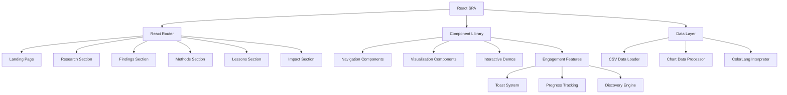
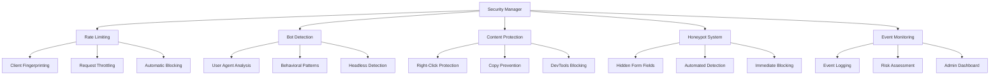

# Design Document

## Overview

The Energy Research Showcase website is a modern, interactive React application that presents two groundbreaking research projects: EnergyLang (energy-efficient programming language) and ColorLang (HSV-based visual programming framework). The site demonstrates technical depth, strategic thinking, and sophisticated AI collaboration through compelling visualizations, interactive demonstrations, and evidence-based storytelling.

### Success Criteria (End in Mind)

**User Experience Success:**
- Visitors immediately understand the research value and technical depth within 30 seconds of landing
- Users spend average 5+ minutes exploring interactive features and demonstrations
- 80%+ of visitors navigate to at least 3 different sections
- Users can successfully interact with data visualizations and ColorLang demos without guidance

**Technical Success:**
- Site loads in <2 seconds on standard broadband connections
- Maintains 95+ Lighthouse performance score
- Achieves WCAG 2.1 AA accessibility compliance
- Works consistently across all target browsers (Chrome 90+, Firefox 88+, Safari 14+, Edge 90+)

**Content Success:**
- Clearly demonstrates both EnergyLang and ColorLang technical sophistication
- Showcases strategic decision-making and AI collaboration methodologies
- Provides actionable insights that visitors can apply to their own projects
- Establishes credibility through evidence-based presentation of findings

## Architecture

### Development Methodology Integration

The implementation of this website will follow the AI Development Methodology principles established in the steering documents:

- **Begin with the End in Mind**: Each feature will start with clear success criteria and user outcome definitions
- **Avoid Sprawl**: Single feature focus with iterative refinement and clear scope boundaries
- **Apply Rigor**: Three-layer verification (automated testing, code review, user validation) for all AI-assisted development
- **Challenge Self**: Multi-persona reviews and alternative exploration before settling on solutions
- **Customer First**: User-centric development with accessibility and performance prioritization

### High-Level Architecture



### Technology Stack

- **Frontend Framework**: React 18+ with TypeScript for type safety and modern features
- **Build Tool**: Vite for fast development server and optimized production builds
- **Routing**: React Router v6 for client-side navigation
- **Styling**: Tailwind CSS for responsive, utility-first design with Headless UI for accessible components
- **Charts**: Chart.js with react-chartjs-2 for interactive visualizations
- **Animations**: Framer Motion for smooth transitions and discovery effects
- **Icons**: Lucide React for consistent, scalable icons
- **State Management**: React Context for global state (user progress, preferences)
- **Data Processing**: Papa Parse for CSV handling, custom processors for energy data
- **Code Quality**: ESLint with TypeScript rules, Prettier for formatting (integrated with Kiro MCP)
- **Testing**: Jest with React Testing Library, fast-check for property-based testing, Playwright for E2E
- **Performance**: Web Vitals monitoring, Lighthouse CI for automated auditing
- **Accessibility**: @axe-core/react for automated accessibility testing

## Components and Interfaces

### Core Layout Components

#### AppLayout
```typescript
interface AppLayoutProps {
  children: React.ReactNode;
}

const AppLayout: React.FC<AppLayoutProps> = ({ children }) => {
  // Header, navigation, footer wrapper
  // Toast notification system
  // Progress tracking context
};
```

#### Navigation System
```typescript
interface NavigationItem {
  id: string;
  title: string;
  path: string;
  description: string;
  completed?: boolean;
  hasInteractive?: boolean;
}

interface NavigationProps {
  items: NavigationItem[];
  currentPath: string;
  onNavigate: (path: string) => void;
}
```

### Data Visualization Components

#### BenchmarkChart
```typescript
interface BenchmarkData {
  benchmark: string;
  count: number;
  meanRuntimeMs: number;
  meanEnergyJ: number;
  jPerFlop: number;
}

interface BenchmarkChartProps {
  data: BenchmarkData[];
  chartType: 'bar' | 'scatter' | 'box';
  metric: 'energy' | 'runtime' | 'efficiency';
  onDataPointHover: (data: BenchmarkData) => void;
  onDiscovery: (feature: string) => void;
}
```

#### InteractiveVisualization
```typescript
interface VisualizationProps {
  title: string;
  description: string;
  data: any[];
  config: ChartConfiguration;
  filters: FilterOption[];
  onFilterChange: (filters: FilterState) => void;
  onFirstInteraction: () => void;
}
```

### ColorLang Demonstration Components

#### ColorLangViewer
```typescript
interface ColorProgram {
  id: string;
  name: string;
  width: number;
  height: number;
  colorField: ColorPixel[][];
  description: string;
}

interface ColorPixel {
  hue: number; // 0-360
  saturation: number; // 0-100
  value: number; // 0-100
  instruction?: string;
  data?: number;
}

interface ColorLangViewerProps {
  program: ColorProgram;
  interactive: boolean;
  onProgramChange?: (program: ColorProgram) => void;
}
```

#### ProgrammingGuide
```typescript
interface Tutorial {
  id: string;
  title: string;
  difficulty: 'Beginner' | 'Intermediate' | 'Advanced';
  description: string;
  steps: TutorialStep[];
  finalProgram: ColorProgram;
}

interface TutorialStep {
  title: string;
  description: string;
  colorCode: string;
  hue: number;
  saturation: number;
  value: number;
  instruction: string;
  data?: number;
  tip: string;
}

interface ProgrammingGuideProps {
  tutorials: Tutorial[];
  programmingTips: ProgrammingTip[];
}
```

#### QuickReference
```typescript
interface ColorReference {
  instruction: string;
  hue: number;
  color: string;
  description: string;
  example: string;
}

interface QuickReferenceProps {
  isOpen: boolean;
  onClose: () => void;
  colorReferences: ColorReference[];
  commonAscii: AsciiCode[];
  quickPatterns: ProgrammingPattern[];
}
```

#### InteractiveExamples
```typescript
interface InteractiveExamplesProps {
  programs: ColorProgram[];
  onProgramSelect: (program: ColorProgram) => void;
  onProgramModify: (program: ColorProgram) => void;
}
```

### ColorLang Learning and Tutorial System

The ColorLang showcase includes comprehensive learning resources to help users understand and create their own visual programs:

#### Programming Guide Features
- **Step-by-Step Tutorials**: Three progressive tutorials from beginner to intermediate level
  - "Your First Program: Print a Number" (Beginner)
  - "Basic Math: Addition" (Beginner)
  - "Print Custom Text" (Intermediate)
- **Interactive Tutorial Steps**: Click-through lessons with visual color coding and progress tracking
- **Program Previews**: Shows final program structure with actual color visualization
- **Programming Tips**: Four categories of helpful hints and best practices

#### Quick Reference System
- **Floating Help Button**: Always-accessible quick reference modal
- **Color Codes Tab**: Common instruction colors with hue values and visual swatches
- **ASCII Codes Tab**: Character codes for text output programming
- **Patterns Tab**: Common programming patterns and templates

#### Enhanced Interpreter Features
- **Smart Execution Order**: Left-to-right for linear programs, top-to-bottom for 2D programs
- **Full Instruction Set**: Support for LOAD, ADD, MUL, DIV, PRINT, HALT with exact hue matching
- **Visual Program Counter**: Shows current execution position with highlighting
- **Register State Tracking**: Real-time display of register values and accumulator
- **Step-by-Step Debugging**: Manual stepping through program execution

#### Example Programs
Six working example programs demonstrate different ColorLang capabilities:
1. **Hello World**: Character-by-character text output using ASCII codes
2. **Simple Arithmetic**: Basic mathematical operations (5+3=8)
3. **Counter Loop**: Loop structures with conditional logic
4. **Fibonacci Sequence**: Recursive number generation (0,1,1,2,3...)
5. **Color Processing**: HSV-based color manipulation with complex mathematics
6. **Neural Network Demo**: Simplified forward pass computation (inputs×weights)

### Engagement and Discovery Components

#### ToastSystem
```typescript
interface ToastMessage {
  id: string;
  type: 'discovery' | 'guidance' | 'achievement';
  title: string;
  message: string;
  action?: {
    label: string;
    onClick: () => void;
  };
  duration?: number;
}

interface ToastSystemProps {
  messages: ToastMessage[];
  onDismiss: (id: string) => void;
}
```

#### ProgressTracker
```typescript
interface UserProgress {
  sectionsVisited: string[];
  interactionsCompleted: string[];
  discoveredFeatures: string[];
  timeSpent: Record<string, number>;
}

interface ProgressTrackerProps {
  progress: UserProgress;
  onProgressUpdate: (update: Partial<UserProgress>) => void;
  onSuggestNext: () => string[];
}
```

## Data Models

### Energy Benchmark Data
```typescript
interface EnergyBenchmark {
  benchmark: string;
  language: string;
  implementation: string;
  count: number;
  meanRuntimeMs: number;
  meanEnergyJ: number;
  meanPowerW: number;
  jPerFlop: number;
  standardDeviation?: number;
  rawMeasurements?: number[];
}

interface BenchmarkComparison {
  languages: string[];
  metrics: {
    energy: EnergyBenchmark[];
    runtime: EnergyBenchmark[];
    efficiency: EnergyBenchmark[];
  };
  keyFindings: {
    mostEfficient: string;
    leastEfficient: string;
    efficiencyRatio: number;
  };
}
```

### ColorLang Program Model
```typescript
interface HSVColor {
  hue: number;        // 0-360
  saturation: number; // 0-100
  value: number;      // 0-100
}

interface ColorInstruction {
  position: { x: number; y: number };
  color: HSVColor;
  opcode: string;
  operands: any[];
}

interface ColorProgram {
  id: string;
  name: string;
  description: string;
  dimensions: { width: number; height: number };
  colorField: HSVColor[][];
  instructions: ColorInstruction[];
  metadata: {
    author: string;
    created: Date;
    complexity: 'simple' | 'intermediate' | 'advanced';
    category: string;
  };
}
```

### User Engagement Data
```typescript
interface EngagementEvent {
  type: 'section_enter' | 'interaction' | 'discovery' | 'completion';
  section: string;
  feature?: string;
  timestamp: Date;
  metadata?: Record<string, any>;
}

interface UserSession {
  sessionId: string;
  startTime: Date;
  events: EngagementEvent[];
  progress: UserProgress;
  preferences: {
    preferredChartType: string;
    showGuidance: boolean;
    animationsEnabled: boolean;
  };
}
```

## Correctness Properties

*A property is a characteristic or behavior that should hold true across all valid executions of a system-essentially, a formal statement about what the system should do. Properties serve as the bridge between human-readable specifications and machine-verifiable correctness guarantees.*

### Property-Based Testing Properties

Based on the prework analysis, the following properties should hold for all valid executions:

**Property 1: Navigation Consistency**
*For any* section navigation interaction, the Research_Site should provide smooth transitions and maintain consistent branding and visual hierarchy
**Validates: Requirements 1.3, 1.5**

**Property 2: Interactive Element Functionality**
*For any* interactive ColorLang example or data visualization, the element should respond to user input and provide the expected functionality
**Validates: Requirements 2.3, 2.5**

**Property 3: Visualization Filtering**
*For any* data visualization, when a user applies filters (language, benchmark type, metrics), the displayed data should accurately reflect the filter criteria and show both raw measurements and normalized comparisons
**Validates: Requirements 5.2, 5.4**

**Property 4: Performance Standards**
*For any* initial page load on standard broadband connections, the page should load within 2 seconds
**Validates: Requirements 10.1**

**Property 5: Responsive Design**
*For any* page accessed on mobile devices, the layout should maintain readability and functionality across different screen sizes
**Validates: Requirements 10.2**

**Property 6: Accessibility Compliance**
*For any* page or component, the site should meet WCAG 2.1 AA accessibility standards for screen readers and keyboard navigation
**Validates: Requirements 10.3**

**Property 7: Data-Driven Navigation**
*For any* navigation interaction, the system should use the data-driven navigation structure and maintain consistency across all sections
**Validates: Requirements 11.2**

**Property 8: Meta Tag Presence**
*For any* page, proper meta tags, Open Graph tags, and structured data should be present for social media previews
**Validates: Requirements 12.1**

**Property 9: Discovery Notifications**
*For any* new section entry, contextual toast notifications should display highlighting key features or insights relevant to that section
**Validates: Requirements 14.1**

**Property 10: Progressive Disclosure**
*For any* user engagement with sections, additional content or interactive elements should be revealed appropriately based on user interaction level
**Validates: Requirements 14.2**

**Property 11: Interactive Guidance**
*For any* interactive element discovery, subtle guidance should be provided to help users understand how to use the features
**Validates: Requirements 14.3**

### Security Architecture

The website implements a comprehensive, multi-layered security framework designed to protect research data and intellectual property while maintaining accessibility for legitimate users.

#### Security Components



#### SecurityManager Class
```typescript
interface SecurityConfig {
  RATE_LIMITING: {
    MAX_REQUESTS_PER_MINUTE: number;
    MAX_REQUESTS_PER_HOUR: number;
    BLOCK_DURATION_MS: number;
    MIN_TIME_BETWEEN_REQUESTS: number;
    MAX_CONSECUTIVE_REQUESTS: number;
  };
  CONTENT_PROTECTION: {
    MAX_COPY_LENGTH: number;
    COPY_WARNING_THRESHOLD: number;
    PROTECTED_SELECTORS: string[];
  };
  BOT_DETECTION: {
    USER_AGENT_PATTERNS: string[];
    HONEYPOT_FIELDS: string[];
  };
  FEATURES: {
    ENABLE_CONTENT_PROTECTION: boolean;
    ENABLE_RIGHT_CLICK_DISABLE: boolean;
    ENABLE_DEVELOPER_TOOLS_BLOCK: boolean;
    ENABLE_COPY_PROTECTION: boolean;
    ENABLE_HONEYPOTS: boolean;
    ENABLE_BOT_DETECTION: boolean;
    ENABLE_ACTIVITY_MONITORING: boolean;
  };
}

interface SecurityEvent {
  type: SecurityEventType;
  level: SecurityRiskLevel;
  timestamp: number;
  fingerprint: string;
  details: Record<string, unknown>;
  userAgent?: string;
  ip?: string;
  referrer?: string;
}

class SecurityManager {
  private rateLimitMap: Map<string, RateLimitEntry>;
  private suspiciousIPs: Set<string>;
  private honeypotTriggers: Set<string>;
  private securityEvents: SecurityEvent[];
  
  checkRateLimit(): boolean;
  detectBotBehavior(): boolean;
  createHoneypot(): HTMLElement;
  enableContentProtection(): void;
  monitorSuspiciousActivity(): void;
  initialize(): void;
  getSecurityStatus(): object;
}
```

#### Security Headers Configuration
Enhanced security headers implemented via Netlify configuration:
- **Content Security Policy**: Prevents XSS and injection attacks
- **X-Frame-Options**: Prevents clickjacking attacks
- **X-Content-Type-Options**: Prevents MIME sniffing
- **X-XSS-Protection**: Browser-level XSS filtering
- **Referrer-Policy**: Controls referrer information leakage
- **HSTS**: Forces HTTPS connections with preload
- **Cross-Origin Policies**: Isolates site from other origins

#### Protected Content Elements
Content protection applies to elements with specific selectors:
- `[data-protected]`: Manually marked protected content
- `.benchmark-data`: Benchmark results and energy data
- `.research-content`: Research methodology and findings
- `.chart-container`: Interactive charts and visualizations
- `.energy-data`: Energy measurement data and analysis

#### Security Monitoring Dashboard
```typescript
interface SecurityMonitorProps {
  isAdmin?: boolean;
  className?: string;
}

interface SecurityStatus {
  rateLimitEntries: number;
  suspiciousIPs: number;
  honeypotTriggers: number;
  botDetected: boolean;
}
```

The security monitor provides real-time visibility into:
- Active rate-limited clients
- Suspicious IP addresses detected
- Honeypot trigger events
- Bot detection status
- Security event timeline
- Admin controls for log management

#### Privacy and Compliance
- **No Persistent Tracking**: Client fingerprints are temporary and anonymized
- **GDPR/CCPA Compliant**: Privacy-by-design architecture with no personal data collection
- **Minimal Data Retention**: Security events retained for 24 hours maximum
- **Transparent Operation**: Security measures invisible to legitimate users

## Error Handling

### Data Loading Errors
- **CSV Parse Failures**: Graceful fallback to cached data or error messages
- **Network Timeouts**: Retry mechanisms with exponential backoff
- **Malformed Data**: Validation and sanitization before visualization

### User Interaction Errors
- **Invalid Filter Combinations**: Clear error messages and suggested alternatives
- **ColorLang Execution Errors**: Detailed error reporting with debugging hints
- **Navigation Failures**: Fallback routes and error boundaries

### Performance Degradation
- **Large Dataset Handling**: Pagination and virtualization for large benchmark datasets
- **Memory Management**: Cleanup of chart instances and event listeners
- **Mobile Performance**: Reduced animation complexity on low-powered devices

### Accessibility Failures
- **Screen Reader Issues**: Alternative text and ARIA labels for all interactive elements
- **Keyboard Navigation**: Focus management and skip links
- **Color Contrast**: High contrast mode support and color-blind friendly palettes

## Testing Strategy

### Dual Testing Approach
The testing strategy combines unit tests for specific functionality and property-based tests for universal behaviors:

**Unit Tests:**
- Component rendering with specific props
- Data transformation functions
- ColorLang interpreter execution
- Toast notification display logic
- CSV parsing and validation
- Specific user interaction flows

**Property-Based Tests:**
- Navigation consistency across all sections (Property 1)
- Interactive element functionality for any valid input (Property 2)
- Visualization filtering accuracy for any filter combination (Property 3)
- Performance standards for any page load (Property 4)
- Responsive design for any screen size (Property 5)
- Accessibility compliance for any component (Property 6)
- Data-driven navigation for any route (Property 7)
- Meta tag presence for any page (Property 8)
- Discovery notifications for any section entry (Property 9)
- Progressive disclosure for any engagement level (Property 10)
- Interactive guidance for any element discovery (Property 11)

### Testing Framework Configuration
- **Unit Testing**: Jest with React Testing Library
- **Property-Based Testing**: fast-check for JavaScript property testing
- **Visual Testing**: Chromatic for component visual regression
- **E2E Testing**: Playwright for full user journey validation
- **Performance Testing**: Lighthouse CI for automated performance auditing
- **Accessibility Testing**: axe-core for automated accessibility validation

Each property-based test should run a minimum of 100 iterations to ensure comprehensive coverage through randomization. Tests should be tagged with comments referencing their corresponding design properties:

```javascript
// Feature: energy-research-showcase, Property 1: Navigation Consistency
test('navigation provides smooth transitions for any section', () => {
  // Property-based test implementation
});
```

### Integration Testing
- **Data Pipeline**: CSV loading → processing → visualization rendering
- **User Journey**: Landing → exploration → discovery → engagement
- **Cross-Browser**: Chrome, Firefox, Safari, Edge compatibility
- **Device Testing**: Desktop, tablet, mobile responsiveness
- **Performance Monitoring**: Real User Monitoring (RUM) for production insights